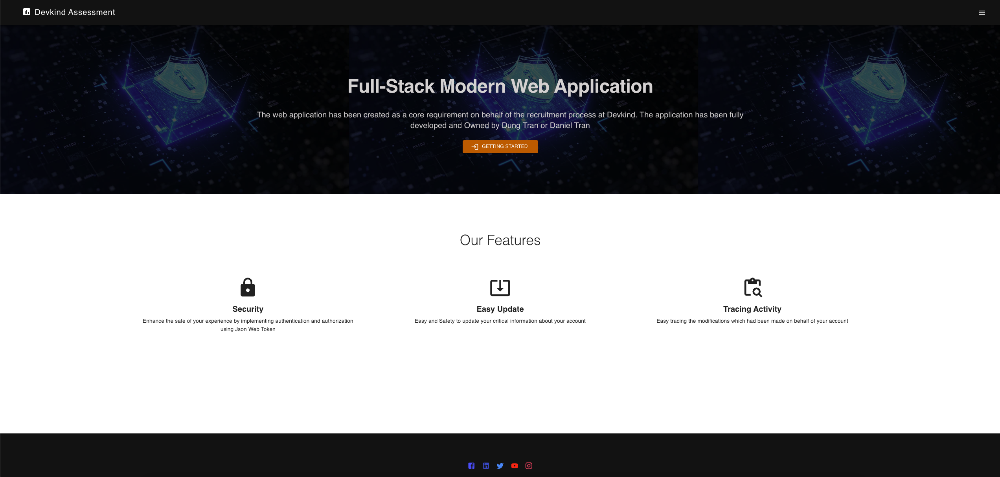
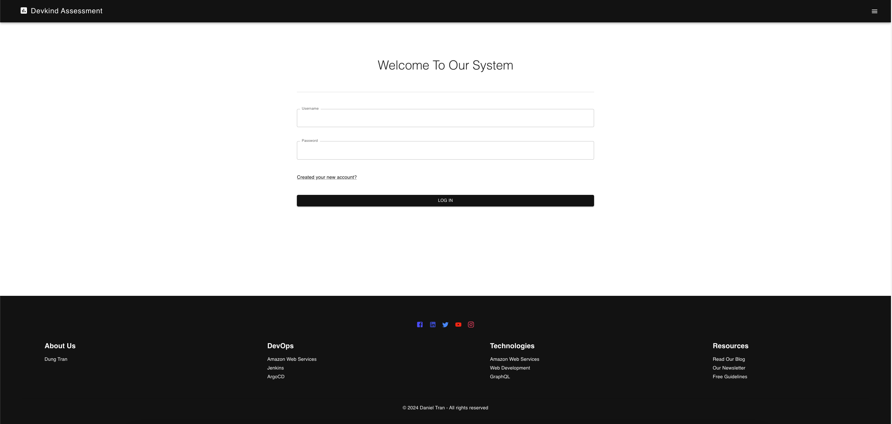
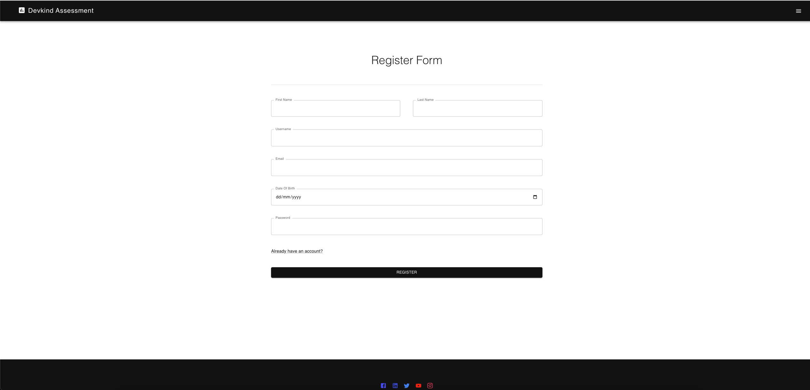
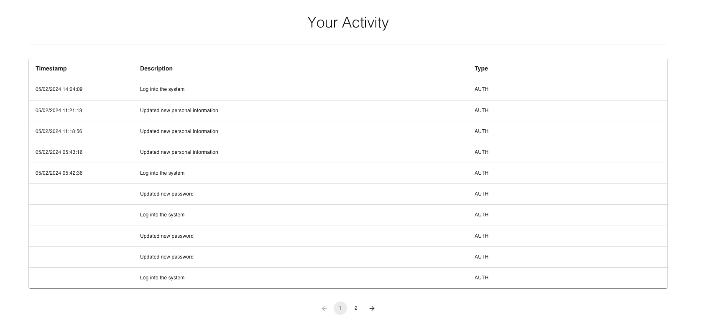
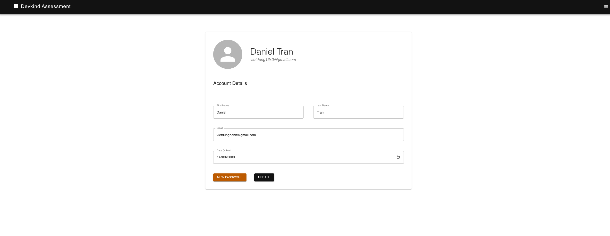
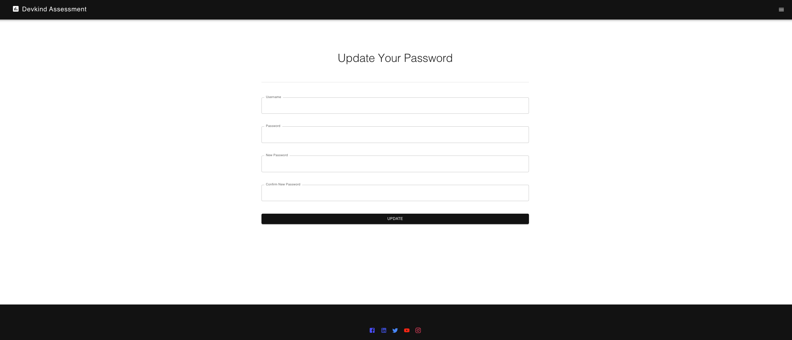

# Devkind Full-Stack Assessment

## Introduction
The application is created on behalf of Devkind's recruitment process. The application consists of three core components: backend,
user interface and database. The project takes me around <b>3 days to complete</b> including development, testing, integration and documents.<br>

Note that the source code of react would be located under `ui` directory while the backend would be located under `barebonesystem`
directory.



## Set Up

In order to launch the application, it is necessary to have Docker installed in your machine. Then, from the root directory
of the project, run:
```bash
docker compose up -d
```

or

```bash
docker-compose up -d
```

The ui will be accessible via `http://localhost:80` while the backend will be accessible via `http://localhost:8000/api/v1`.
Note that it is necessary to make port 80, 3306 and 8000 available to use!

## Features
### 1. Authentication

### 2. Register

### 3. Tracing Activity

### 4. Account Update

### 5. Update Password


## Technologies 

### 1. React Typescript
The UI of the project utilizes React Typescript alongside with Material UI to rapidly developed the user interface for the application.
The project also utilizes Yup and Formik to validate and sanitize user's input

### 2. Java Springboot
Springboot had been used as core backend framework in this assignment. The test cases would be built around this framework.<br>
The project is mainly focusing on Security, Validation and Database. It utilizes the following libraries and packages for its purposes:
- Spring Validation: For validate and sanitize user's input
- Spring Security: For security context inside the application
- JSON Web Token: For authentication mechanism
- Hibernate/JPA Data: Enables ORM in Spring Boot Application to interact with relational database
- MySQL JDBC Driver: Connect to MySQL
- Spring Test and Spring Security Test: For testing the application and security


### 3. MySQL
For rapid database lanching, I utilize MySQl for data storing purpose

### 4. Docker
Docker is one of the core component in this project since it helps you launching the database and also launch the application
using docker compose. It would be easier to use Docker-Compose to launch this application.
